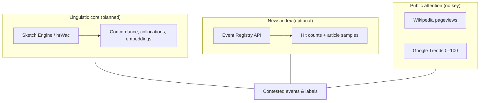
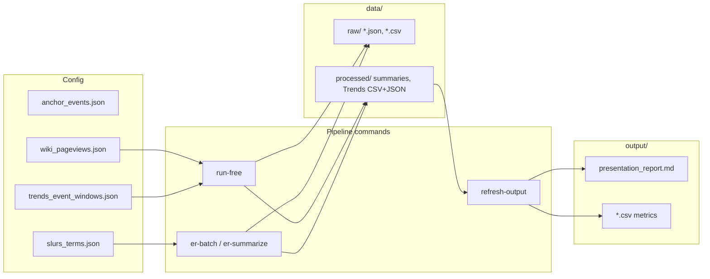
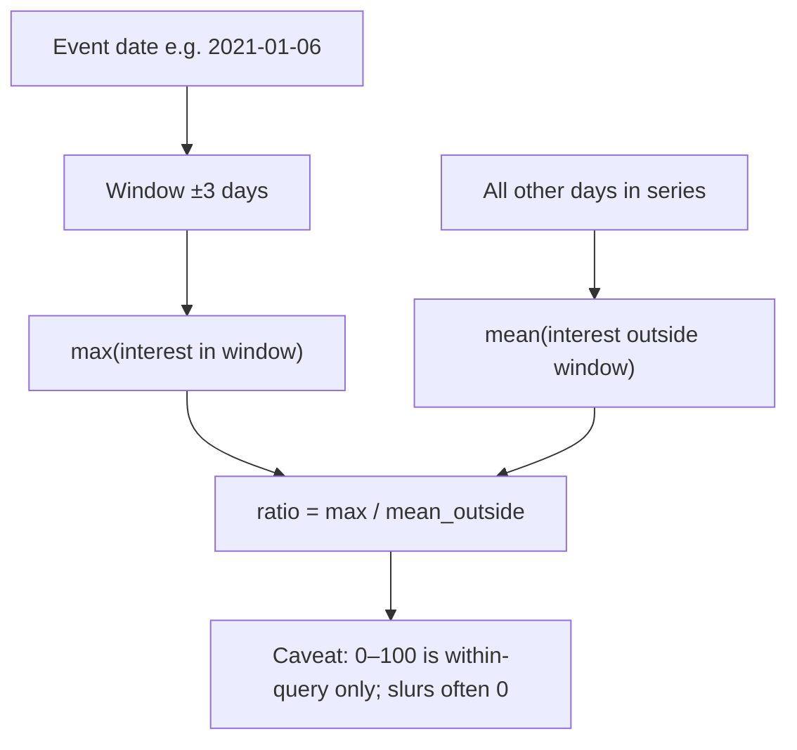
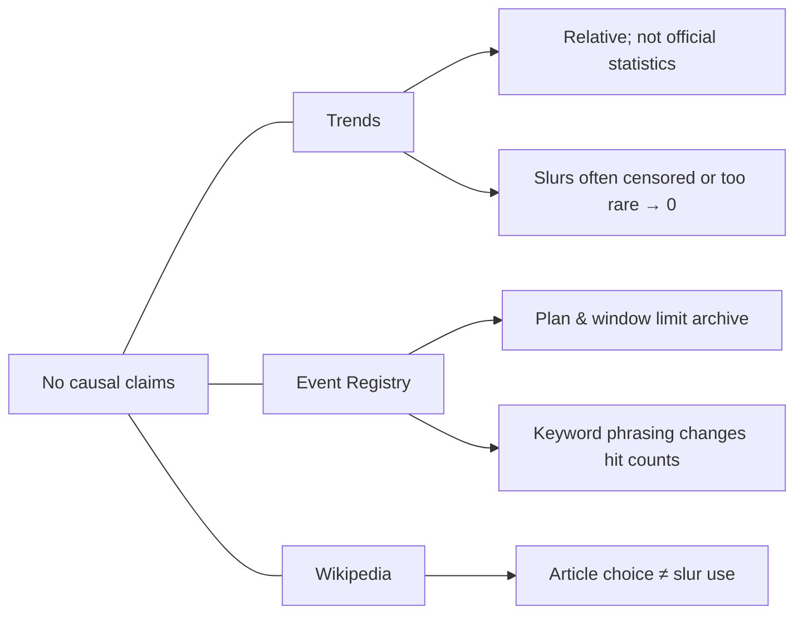

# Methodology diagrams

These **Mermaid** blocks render in GitHub, many Markdown viewers, and IDEs. They mirror the **triangulation** design: corpus (primary) plus **auxiliary** news index and attention layers.

---

## 1. Triangulation of evidence

Three layers answer different questions; they are **not** expected to “agree” on the same number—interpretation is partly about **tension** between them.

---

## 2. Data flow (from config to `output/`)

---

## 3. “Spike ratio” around an anchor day (Google Trends)

Heuristic used in `trends_summary_*.json`: for each keyword, **max** interest in a **±N day** window around the event day vs **mean** interest **outside** that window. Ratio highlights **relative** salience, not absolute search volume.

---

## 4. Limitations at a glance

---

## 5. How this relates to the paper

- **Primary** linguistic analysis is still **corpus**-driven (hrWac); this repository’s export mainly **contextualises** slurs and labels with **attention** and **news index** snapshots.
- **Contested events** (same episode, different public names) are the **bridge** between layers: e.g. riot vs. protest language (US) or commemoration windows (HR).

Regenerate numbers: `python -m pipeline run-free` and `python -m pipeline refresh-output`.

---

## 6. BigQuery / GDELT (optional, not in default stack)

**GDELT** via **Google BigQuery** would add a large **news-scale** check next to Event Registry and Google Trends. It is **not** required for the current export: this project runs on **Wikipedia pageviews**, **Google Trends**, and **Event Registry** (optional) without cloud credentials.

When you add a GCP project and service-account JSON (typical on a VPS), you can plug in queries against the public `gdelt-bq` datasets and merge summaries into `output/` the same way as other `data/processed/*.json` sources. See `output/HANDOFF_execute_without_bigquery.md` and the operational validation plan for scope.
