# Slurs, polarization, and public discourse
**Empirical snapshot for STAL / joint work (Cerovac & Perhat)**
*Generated: 2026-04-30 06:55 UTC — pipeline manifest date `2026-04-30`. See `output/*.csv` and `data/processed/` for sources.*

---

## How to read this document (where the explanations are)

**Sections 1–7** are the **substantive handout**: they explain **what we measured**, **why it matters for slurs and polarization**, and **how not to over-read** the numbers. **§1.5** adds diagrams; **each diagram** now has a **caption** (what to say in the room) and an **explanation** (what the picture means). **§8** is only the **shell commands** to regenerate files. **§9** is a **technical appendix** (inputs, outputs, procedures). If you opened this file looking for **paragraphs about findings**, stay in **§1–§7**; if you looked at **§8–§9 only**, scroll up.

---

## 1. One-sentence pitch

Political slurs do not only harm targets: they **shape** who counts as a worthy interlocutor. This project **triangulates** (1) **measured** **word-form** **concordance sizes** in **hrWac** 2.2+ (Sketch, §2.5), (2) **news index** samples (Event Registry, where used), and (3) **public attention** (Wikipedia pageviews + Google Trends) around **contested** events and **competing labels**.

### 1.1 Plain-language gloss (what this project actually measures)

This repository **does not** output a single “polarization score” for society. Instead it **lines up several imperfect lenses**: **(a)** how often selected **surface word forms** appear in a large **Croatian web corpus** (Sketch / hrWac), **(b)** how many **news articles** match short textual queries in **Event Registry** (with language and recency filters), and **(c)** how **Wikipedia traffic** and **Google Trends** curves move near **dates you label as important** in `config/anchor_events.json`. The **scientific payoff** is **disagreement between lenses**: the same string can be **rare in Trends**, **non-trivial in hrWac**, and **high or low in ER** depending on phrasing and archive coverage—**that triangulation** is the finding, not any one column in isolation.

### 1.2 What we do *not* claim (scope guardrails)

We do **not** infer **causal** effects of an event on hate speech. We do **not** treat **Trends** as absolute search volume, **Wikipedia** as a proxy for “all readers”, or **Event Registry** as the whole news world. We do **not** treat **hrWac N** as moral frequency or as spoken-language prevalence. Every layer has **documented limits** (see **§7**).

---

## 1.5 Diagrams (Mermaid)

**What this subsection is for:** Each figure below is a **visual outline** you can paste into slides. Under every diagram you get a **caption** (what to say aloud) and an **explanation** (what the picture **means** for your argument). Technical command-line detail lives in **§9**.

### A. Triangulation — three evidence families

**Caption (say aloud):** “We do not rely on one archive. Linguistic **token** rates in hrWac, **news index** hits, and **attention** curves each measure something different; we read them **side by side**.”

**Explanation:** The three coloured groups are **independent families** of evidence. **Corpus** counts tell you how common a **surface string** is in **written** Croatian web text. **News indices** tell you how often **article bodies** match a query in a **commercial** archive (with its own language and recency rules). **Attention** layers show **relative** public interest (Trends) or **traffic** to chosen Wikipedia pages—not slur frequency on those pages. Dotted lines from **Anchor events** mean: we **line up** charts and tables in **time** around the same calendar episodes; that is **alignment**, not a claim that the event **caused** the counts.

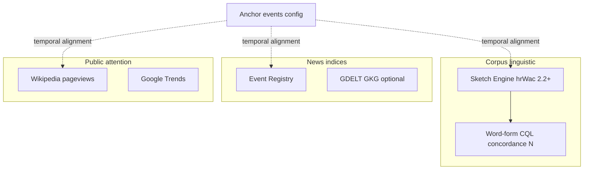

### B. From configuration to this report

**Caption (say aloud):** “Everything you see in the handout is **reproducible**: JSON configs drive CLI commands, raw pulls land under `data/raw`, summaries under `data/processed`, then one compiler pass writes `output/`.”

**Explanation:** This is the **software path**, not the theory. **`refresh-output`** never calls external APIs; it only **reads** files already on disk. That separation matters: you can **rebuild the narrative** after fixing a query in config **without** re-hitting paid APIs, as long as the underlying JSON/CSV still exists.

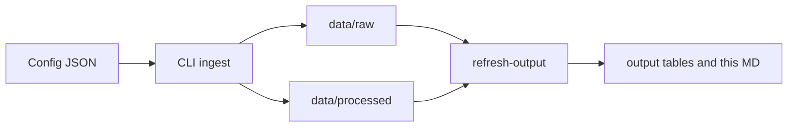

### C. Operational hypotheses (H1–H3)

**Caption (say aloud):** “We register three **testable** intuitions: Trends favours mainstream labels over slur strings; BigQuery GKG—when run—gives a coarse **global news** check; ER and Trends **rank** terms differently.”

**Explanation:** **H1** is about **suppression and scale** in Google’s Trends product (zeros are common for slurs). **H2** is optional and depends on **GCP**; it is about **very large** news tables, not fine semantics. **H3** is a **methods** warning: comparing **rank orders** across ER and Trends is misleading without reading how each index is built.

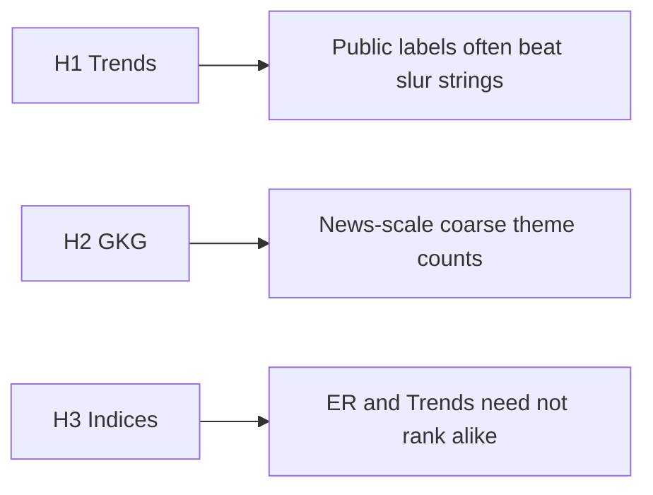

### D. Optional: contested labels vs one episode (illustrative)

**Caption (say aloud):** “The **same day** can carry **rival public names** for one episode; Trends often makes that visible. Slur strings may stay flat even when political labels spike.”

**Explanation:** This diagram is a **pedagogical** device for **Jan 6–style** or **memory-politics** cases: you plot several **keywords** with **legitimate** descriptive disagreement (riot vs. protest; competing ethnonational labels) and compare **spike ratios** from `trends_summary_*.json`. It does **not** say which label is morally correct; it shows **where measurable attention goes** in one proprietary index.

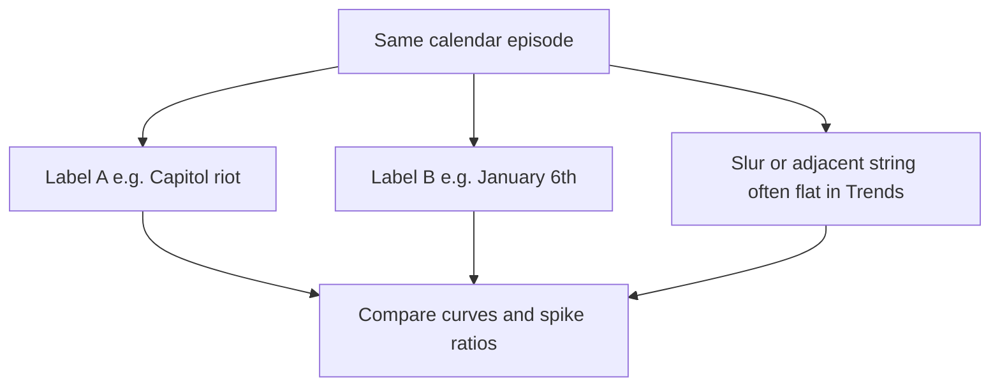


---

## 2. Anchor events (paper / talk; see `config/anchor_events.json`)

**Explanation:** Anchor events are **calendar and place anchors** for your **talk**, not statistical regressors inside this export. They give **shared reference dates** (e.g. Capitol 2021-01-06, Thompson concert 2025-07-05, Kirk 2025-09-10) so that **Trends windows**, **ER recency filters**, and **slide titles** point at the **same episode**. Rows with **“—”** dates are placeholders: fill `approx_date` in `config/anchor_events.json` when you lock the paper.

- **thompson_hipodrom_2025** (Croatia): Koncert Marka Perkovića Thompsona (Hipodrom, Zagreb) — **2025-07-05** (Hipodrom Zagreb)
- **folklore_attack** (Croatia): Napad na srpske folkloraše — **—**
- **antifascist_protest** (Croatia): Prosvjed protiv fašizma — **—**
- **kirk_assassination_2025** (United States): Atentat / ubojstvo Charliea Kirka (SAD) — **2025-09-10** (Utah Valley University, Orem, UT)
- **capitol** (United States): Napad na Kapitol — **2021-01-06**

**Trends runs** for 2025 windows are listed in `config/trends_event_windows.json` (`hr_thompson_hipodrom_2025`, `us_kirk_2025`) — pull them with `python -m pipeline trends-run`. Google / pytrends may rate-limit or return empty series; optional **BigQuery** via `gdelt-snapshot` (see **`docs/PIPELINE.md`**).

---

## 2.5. Croatian web corpus (Sketch / hrWac 2.2+)

**Explanation:** This table is the **linguistic** leg of triangulation. **N** is Sketch’s **concordance size** for the exact **word token** in the query (e.g. the string as written in `config/slurs_terms.json`), **not** a lemma count and **not** sentiment. A **small N** means “this surface form is rare in **this** tagged web snapshot”, not “the concept is unused in politics”. A **large N** means “the token appears often in **this** corpus”, not “people approve of it”. The JSON file also stores a few **KWIC** lines for qualitative illustration—handle ethically in teaching.

| id | Keyword | N (≈ concordance size) | Notes |
|----|---------|--------------------------|-------|
| hrv_jugocetnici | jugočetnici | 5 | HR |
| hrv_jugokomunisti | jugokomunisti | 155 | HR |
| hrv_klerofasist | klerofašist | 67 | HR STAL focus |
| hrv_ustase | Ustaše | 2,351 | HR historical slur label |

Corpus: `preloaded/hrwac22_rft1`; **CQL** is surface **word** form, not lemma; FUP: batched in pipeline with a small `pagesize`. Source: `data/processed/sketch_hrwac_slurs.json`.

---

## 3. Operational hypotheses (falsifiable)

**Explanation:** Hypotheses here are **operational**: they refer to **measurable behaviour of our instruments**, not to deep causal laws of culture. **H1** is about **Trends’ numeric behaviour** around anchors versus slur strings. **H2** (when GDELT runs) is about **coarse GKG theme matches** in a BigQuery slice. **H3** is a **disciplining** claim: **do not** merge Event Registry and Trends into one ranking without reading **how** each is built.

- **H1 (attention / Trends):** Around anchor days, **public labels** (event names, places, movement names) tend to show **higher** relative 0–100 interest in Trends than many **slur** strings, which are often **0** or suppressed.
- **H2 (news at scale / GKG on BigQuery):** Not in this run. Install the optional BigQuery extra (see docs/PIPELINE.md), set GOOGLE_CLOUD_PROJECT and auth, then: python -m pipeline gdelt-snapshot.
- **H3 (index sensitivity):** **Event Registry** hit counts and **Google Trends** curves are **not** the same design: do not expect them to **rank** terms identically (window, language, plan limits).

**How to falsify (examples):** For **H1**, find a stable window where a **slur string** repeatedly **outscores** mainstream labels around the same anchor (would weaken the illustrative pattern). For **H3**, show the **same** keyword list producing **opposite rank orders** in ER vs Trends **because of known filter differences**—that would **support** H3 as a methods fact, not refute the project.

**Cross-source stack:** **Wikipedia** (pageviews) + **Google Trends** + **Event Registry** (when `data/raw` has evidence) + **hrWac / Sketch** (`data/processed/sketch_hrwac_slurs.json` after `sketch-slurs`) + **optional GDELT** (`gdelt-snapshot` → `gdelt_summary_*.json`). Full table: `output/presentation_metrics.csv`.

---

## 4. Suggested slide order (8–12 slides)

**Explanation:** The table is a **storyboard**, not a rigid rule. Use it when moving from **methods** to **examples**: introduce triangulation (rows 1–3), show **terms** (row 4), then give **one number each** from Wikipedia, ER, Trends, and corpus where available (rows 5–7), then **contested framing** (rows 8–9), then **limitations** (row 10). **Row 3a** is where you show **hrWac N** as “written Croatian web, token form”.

| # | Slide title | Content |
|---|-------------|---------|
| 1 | Title | *Slurs and Political Polarization* — epistemic & political harms; Croatia & Anglo-American comparison |
| 2 | Research gap | Slurs in **equal-status** political conflict; not only hate speech law cases |
| 3 | Design | **Triangulation**: corpus (hrWac) + news (Event Registry) + attention (Wiki, Trends) + **anchor events** (`config/anchor_events.json`) |
| 3a | **hrWac (Sketch)** | **HRV** slur list: **word-form** CQL → **N** (concordance size) + small KWIC in `data/processed/sketch_hrwac_slurs.json` (also §2.5) — run `sketch-slurs` |
| 4 | Terms (prijedlog) | EN: libtard, MAGA, teabagger — HR: jugočetnici, jugokomunisti, klerofašist, Ustaše |
| 5 | **Wikipedia (attention, no key)** | EN *Political polarization* article: **~23.9k** total daily views over 90 days; peak day **566** views. HR *Hrvatska*: **~53.0k** sum; peak **884** — *broad* attention, not slur-specific* |
| 6 | **Event Registry (news, if available)** | **MAGA** & **Ustaše** return many index hits; several HR slur strings **rare or zero** in a short window — *phrase choice and archive limits matter* — see `output/eventregistry_snapshot.csv` |
| 7 | **Google Trends (illustration)** | **Jan 6 (2021)** & **Oluja (2024)** windows: mainstream labels **spike** more than some slur strings; *libtard* / *Ustaše* often **0** in Trends. **2025:** *Thompson* (Hipodrom, 5 July) and *Kirk* (10 Sept) — if `trends_iot_*.csv` exist after `trends-run` |
| 8 | “Contested event” | Same episode, **different public labels** (riot vs. protest; memory politics) + **low slur salience in Trends** |
| 9 | **2025 anchors (optional slide)** | **Thompson** concert Zagreb; **Kirk** assassination US — *dates in config; Trends curves optional* |
| 10 | Limitations | Trends **0–100**; Event Registry **free tier**; GKG = coarse substring counts; **no** causal claim |
| 11 | Next step | Refine **CQL** (lemmata, diacritics, near-synonyms); `gdelt-snapshot` for BigQuery cross-check; `output/methodology_diagrams.md` |

*Wikipedia numbers from the latest `wiki_batch_*.json` in `data/raw/`. Regenerate: `python -m pipeline run-free` then `python -m pipeline refresh-output`.*

---

## 5. Key numbers to say aloud

**Explanation:** This section is **speaker notes**: short **numeric anchors** you can quote in Q&A. Each bullet ties to a **different instrument**, so rehearse the **one-sentence caveat** per bullet (Wikipedia = article choice; ER = index + window; hrWac = token in web corpus; Trends = relative and often zero for slurs). The **spike ratios** in the Trends line come from **`trends_summary_*.json`**: “max around event” divided by “mean outside window” for a ±3 day band in the **legacy demo** windows—see those JSON files for exact definitions.

- **Wikipedia (90 days):** EN *Political polarization* **23,919** total daily views; HR *Hrvatska* **53,023** (attention context).
- **Event Registry (indexed news, last batch):** e.g. **MAGA** ~**12,543** total hits; **Ustaše** **276**; several HR terms **0** in the same search setup — *interpret as “sparse in that index + window”, not as “unused in society”.*
- **hrWac 2.2+ (word-form CQL; not lemma):** *jugočetnici* **5**; *jugokomunisti* **155**; *klerofašist* **67**; *Ustaše* **2,351** — *see* `data/processed/sketch_hrwac_slurs.json`
- **Trends (spike ratio ±3 days around event, legacy demo windows):** *Capitol riot* **~12.12**; *January 6th* **~11.48**; *MAGA* **~3.20**; *libtard* **0.0**; *Stop the Steal* **~6.59**; *Oluja* **~30.2**; *Ustaše* **0.0** in Trends.

Full table: `output/presentation_metrics.csv`
Trends detail: `output/trends_spike_summary.csv`
Event Registry: `output/eventregistry_snapshot.csv`
Methodology: `output/methodology_diagrams.md` — `output/HANDOFF_execute_without_bigquery.md` (scope when skipping BigQuery)

---

## 6. Figures you can show (export from project data)

**Explanation:** Each item is a **ready-made export path** (CSV/JSON) you can plot in Excel, R, or Python. **Line charts (1–3)** are for **temporal** narrative: show the **event date** as a vertical rule so the audience sees **co-movement** (or lack of it) with slur strings. **Bar chart (4)** summarises **spike ratios** across keywords—good for “mainstream label vs slur string” contrast. **Tables (5–6)** are for **index-level** comparisons (ER totals vs hrWac **N**): stress that **units differ** (article hits vs concordance lines).

1. **Line chart:** `data/processed/trends_iot_us_capitol_contested_2021.csv` — mark **2021-01-06** vertical line.
2. **Line chart:** `data/processed/trends_iot_hr_oluja_window_2024.csv` — mark **2024-08-05** (Oluja).
3. **Optional 2025:** `data/processed/trends_iot_hr_thompson_hipodrom_2025.csv` and `data/processed/trends_iot_us_kirk_2025.csv` (after `trends-run`) — mark **2025-07-05** and **2025-09-10** if the series are non-empty.
4. **Bar chart:** `trends_spike_summary.csv` — *ratio* (drop zeros for slur-focused story).
5. **Table:** `eventregistry_snapshot.csv` — *total_results* by term (caveat on index).
6. **Table (corpus N):** `data/processed/sketch_hrwac_slurs.json` — **word-form** **N** per HRV slur; optional mini KWIC lines in the same file (FUP — do not re-scrape the corpus at scale outside Sketch rules).

---

## 7. One-minute “limitations” monologue (honest, referee-proof)

**Explanation:** Use this block as a **verbatim** or **paraphrased** closing if a referee asks “what are you *not* claiming?”. It restates **instrument limits** (Trends suppression, ER archive, GKG coarseness, hrWac as **written web** only) and repeats that **alignment** in time is **exploratory**.

- **hrWac / Sketch** — **N** in §2.5 is a **word-form** concordance size in the tagged **web** corpus, not a claim about spoken usage. **FUP** limits batch sampling. Trends and Event Registry remain **auxiliary** **attention** / **news** indices.
- **Google Trends** is **not** official or absolute volume; **slurs** are often **hidden or zero**.
- **Event Registry** depends on **plan**, **time window**, and **keyword**; free tier is **not** full archive.
- **GDELT** requires GCP billing on many accounts; use **short** date windows; interpret GKG as approximate.
- **Alignment** of curves and events is **exploratory** — not causal inference.

---

## 8. How to refresh this report

**Explanation:** This section is **only** the **command sequence** to reproduce the CSV/MD artefacts. It does **not** replace **§1–§7** for interpretation. Run commands from the project root with the venv activated; see **§9** for what each step reads and writes.

**Full stack (all layers):** run the block below top to bottom. **Event Registry** needs `EVENTREGISTRY_API_KEY` in `.env`. **Sketch / hrWac** needs `SKETCH_ENGINE_USER` and `SKETCH_ENGINE_KEY`. **GDELT** needs `pip install -e ".[gdelt]"` once, then `GOOGLE_CLOUD_PROJECT` plus BigQuery auth (`GOOGLE_APPLICATION_CREDENTIALS` or ADC); if GDELT is skipped, the report still builds.

```bash
cd slurs_cer_julija
source .venv/bin/activate
python -m pipeline run-free
python -m pipeline er-batch
python -m pipeline er-summarize
python -m pipeline trends-run
python -m pipeline sketch-slurs
# One-time (or after upgrades): pip install -e ".[gdelt]"
python -m pipeline gdelt-snapshot
python -m pipeline refresh-output
```

---

## 9. Processes and procedures (detailed reference)

**Relationship to §1–§7:** The sections above explain **findings and talk structure**. This appendix explains **machinery**: commands, config files, and on-disk paths so a colleague can **reproduce** the tables. If anything here seems to repeat an idea from §1–§7, treat **§9** as the **technical** spelling-out. A consolidated **install / CLI** sheet also lives in **`docs/PIPELINE.md`** at the repository root.

This section explains **what each pipeline step does**, **what it reads and writes**, and **how to interpret** outputs. Executive diagrams also appear in **§1.5**. Commands assume the project root `slurs_cer_julija`, venv active, and optional keys in **`.env`** (the repo loads it via `python-dotenv`; you do not commit secrets).

---

### 9.1 Configuration map (inputs)

| File | Role |
|------|------|
| `config/slurs_terms.json` | Keyword list for **Event Registry** batch and (HRV subset) **Sketch** word queries |
| `config/wiki_pageviews.json` | Which Wikipedia articles and date span **`wiki`** uses |
| `config/trends_event_windows.json` | **Google Trends** runs: geo, event date, keyword batches (≤5 per request) |
| `config/anchor_events.json` | Human-readable **anchor events** for slides and alignment narrative |
| `config/gdelt_queries.json` | Optional **BigQuery** windows and theme substrings for **GDELT** |
| `config/sketch_croatian.json` | Notes + default **hrWac** corpus id for Sketch |
| `docs/PIPELINE.md` | **Install, `.env`, CLI**, repository layout (developer reference) |

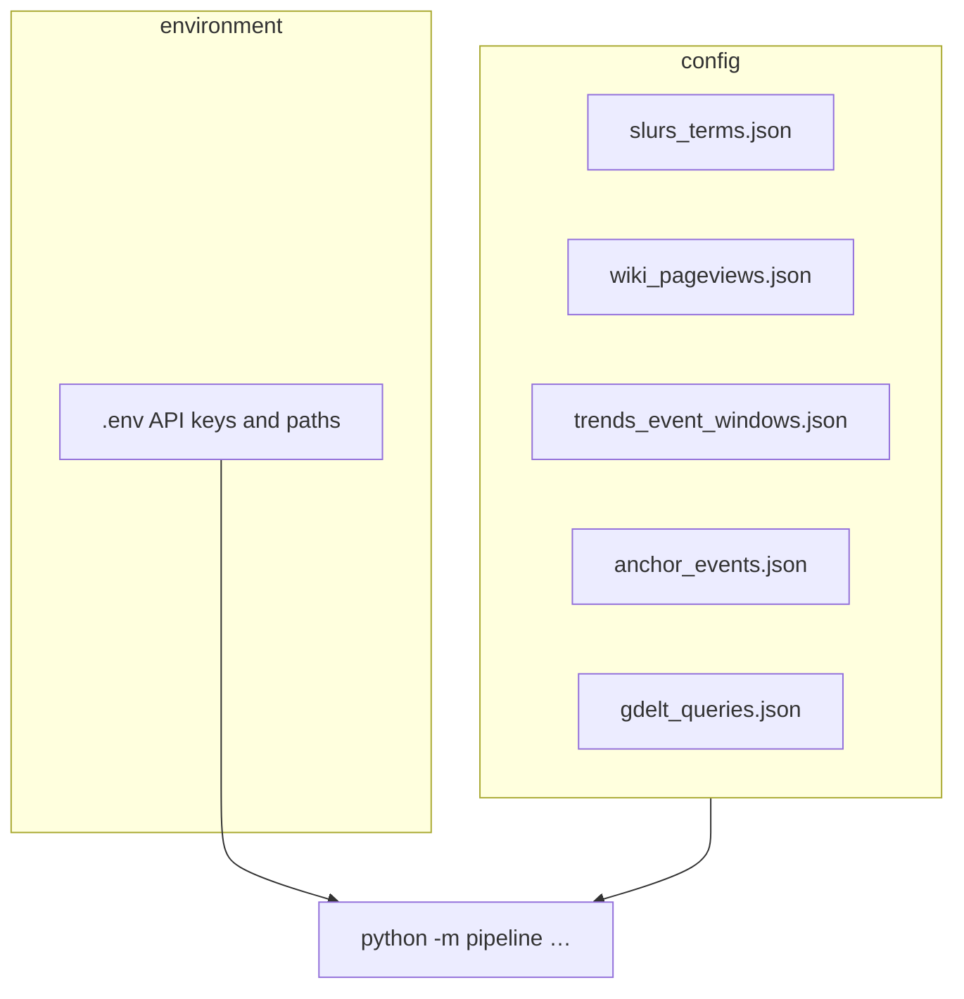

---

### 9.2 Procedure: `run-free` (no paid news APIs)

**Purpose:** Refresh the **free** layers only: **Wikipedia** daily pageviews and **Google Trends** time series, and write a small **manifest** listing what was produced.

**Reads:** `config/wiki_pageviews.json`, `config/trends_event_windows.json`. **Requires:** `pip install -e ".[trends]"` for Trends (pytrends is unofficial; respect rate limits).

**Writes:**
- `data/raw/wiki_batch_<id>.json` — per-article daily views in the configured window.
- `data/processed/trends_iot_<run_id>.csv` — 0–100 interest by date for each keyword batch.
- `data/processed/trends_summary_<run_id>.json` — metadata plus **spike ratio** (max around event vs baseline).
- `data/processed/free_pipeline_<date>.json` — manifest with paths for downstream **`refresh-output`**.

**Procedure (internal):** For each Wikipedia page, call the Wikimedia pageviews API. For each Trends run in JSON, build a timeframe around `event_date`, request interest-over-time for up to five keywords per batch, sleep between runs on 429, compute spike statistics, save CSV + JSON.

**Interpretation:** Wikipedia sums are **broad attention** to a chosen article, not slur frequency. Trends values are **relative within each request**, not absolute search volume; **slurs often read as zero**.

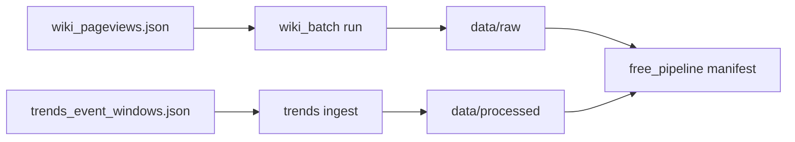

---

### 9.3 Procedure: Event Registry (`er-batch`, `er-summarize`, single pulls)

**Purpose:** Sample **indexed news** matching each keyword (phrase / simple / exact per API settings), with language and recency filters.

**Credentials:** `EVENTREGISTRY_API_KEY` in `.env`. Free tiers are **window- and quota-limited**; zero hits often means **index or query mismatch**, not absence of discourse offline.

**`er-batch` procedure:** Load `config/slurs_terms.json`, throttle with `sleep_seconds_between_requests`, for each row call the article search API, write `data/raw/eventregistry_evidence_<id>.json` (+ CSV when enabled), append to `data/raw/batch_run_<timestamp>.log.json`, optionally regenerate **`eventregistry_summary.csv`**.

**`er-summarize` procedure:** Scan existing `eventregistry_evidence_*.json` files and rebuild `data/processed/eventregistry_summary.csv` (totals and pagination metadata) **without** new HTTP calls.

**`er-evidence` / `er-sample`:** One-off probes for testing credentials or ad hoc keywords.

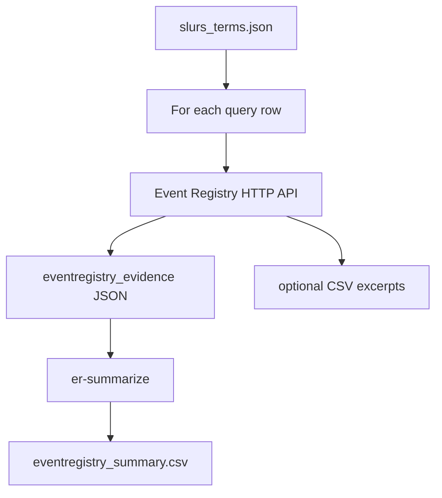

---

### 9.4 Procedure: Google Trends (`trends-run`, `trends-window`)

**Purpose:** Plot **relative** public interest (0–100) for labelled keywords near anchor dates.

**`trends-run`:** Same engine as inside `run-free`, but can be run alone after config edits. Reads `trends_event_windows.json`; optional `--id` limits to one run.

**`trends-window`:** Ad hoc: pass center date, padding days, geo, and a comma-separated keyword list.

**Outputs:** CSV time series + JSON summaries under `data/processed/`. **`refresh-output`** reads summaries to populate §5 spike bullets and `trends_spike_summary.csv`.

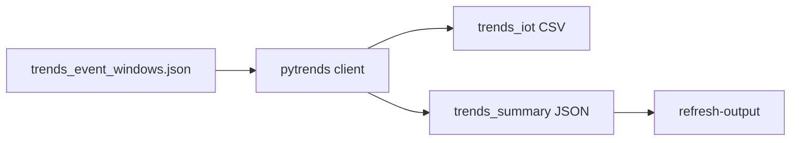

---

### 9.5 Procedure: Sketch Engine / hrWac (`sketch-ping`, `sketch-view`, `sketch-slurs`)

**Purpose:** **Linguistic** grounding on the large Croatian **web** corpus **hrWac 2.2+** (default corpus id `preloaded/hrwac22_rft1`).

**Credentials:** `SKETCH_ENGINE_USER` and `SKETCH_ENGINE_KEY` (HTTP Basic to Bonito API).

- **`sketch-ping`:** `corp_info` — validates user, key, and corpus name; writes JSON under `data/raw/`.
- **`sketch-view`:** Single **concordance** (`view`) for a full **CQL** string starting with `q[`; synchronous mode, small `pagesize`.
- **`sketch-slurs`:** For each **HRV** (or `eng` / `all` via `--lang`) entry in `slurs_terms.json`, builds `q[word="…"]` (surface token, not lemma), calls `view`, records **`concsize`** and a few **KWIC** lines, throttles between calls (**FUP**). Writes `data/processed/sketch_hrwac_slurs.json` plus a timestamped copy.

**Interpretation:** `concsize` is a **corpus index size** for that token form in hrWac, not usage in speech and not a moral frequency claim.

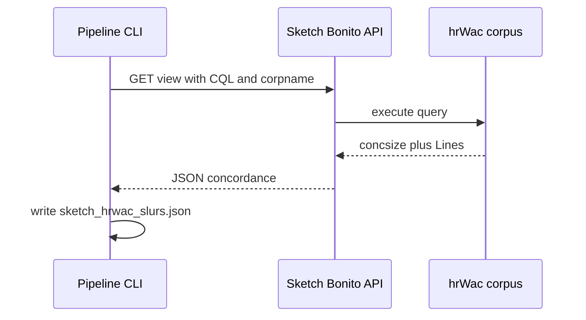

---

### 9.6 Procedure: GDELT GKG via BigQuery (`gdelt-snapshot`, optional)

**Purpose:** Coarse **news-scale** check: count **GKG** rows in a partition window where **`V2Themes`** contains configured substrings (OR logic).

**Requires:** `pip install -e ".[gdelt]"`, **`GOOGLE_CLOUD_PROJECT`** in `.env`, and Application Default Credentials or **`GOOGLE_APPLICATION_CREDENTIALS`** to a service account JSON with BigQuery job scope.

**Writes:** `data/processed/gdelt_summary_<date>.json`. **`refresh-output`** merges the latest file into **§3 H2** text and **`presentation_metrics.csv`** when present.

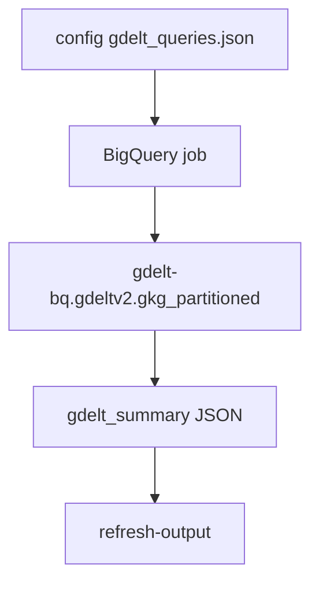

---

### 9.7 Procedure: `refresh-output` (report compiler)

**Purpose:** Deterministic **regeneration** of `output/presentation_report.md`, `output/presentation_metrics.csv`, `output/trends_spike_summary.csv`, and `output/eventregistry_snapshot.csv` from whatever is already on disk under `data/`.

**Does not** call Wikipedia, Trends, Event Registry, Sketch, or BigQuery. It **reads** latest manifests, summary JSON/CSV, Wikipedia batch JSON, optional `sketch_hrwac_slurs.json`, optional `gdelt_summary_*.json`, and fills the Markdown template (including **§1.5** and **§9** static annex, dynamic tables for §2.5, and numeric slots for §4–§5).

**When to run:** After any ingest step you want reflected in the handout, e.g. the sequence in **§8**.

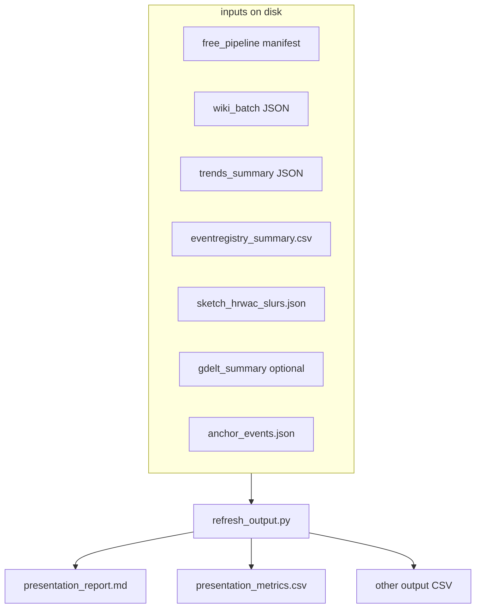

---

### 9.8 Other helpful commands

| Command | Use |
|---------|-----|
| `python -m pipeline doctor` | Print which **env vars** are set (no secret values) |
| `python -m pipeline wiki …` | One article’s **pageviews** without editing `wiki_pageviews.json` |
| `python -m pipeline run-all` | Convenience wrapper: **`er-batch`** then summary (same as manual ER chain) |
| `python -m pipeline er-evidence …` | Single **Event Registry** pull with CLI flags for window and search mode |
| `python -m pipeline trends-window …` | **Ad hoc** Trends window from the command line |

---

### 9.9 Diagram index in this document

| Location | Diagrams |
|----------|----------|
| **§1.5** | Triangulation (A), config-to-report (B), hypotheses H1–H3 (C), contested labels (D) |
| **§9** | Config map (9.1), `run-free` (9.2), Event Registry loop (9.3), Trends (9.4), Sketch sequence (9.5), GDELT (9.6), `refresh-output` (9.7) |

For additional static methodology figures (outside this auto-generated file), see **`output/methodology_diagrams.md`**.


---

*Main files: `presentation_report.md`, `presentation_metrics.csv`, `trends_spike_summary.csv`, `eventregistry_snapshot.csv`, `data/processed/sketch_hrwac_slurs.json` (after `sketch-slurs`), `data/processed/gdelt_summary_*.json` (after `gdelt-snapshot`), `methodology_diagrams.md`.*
